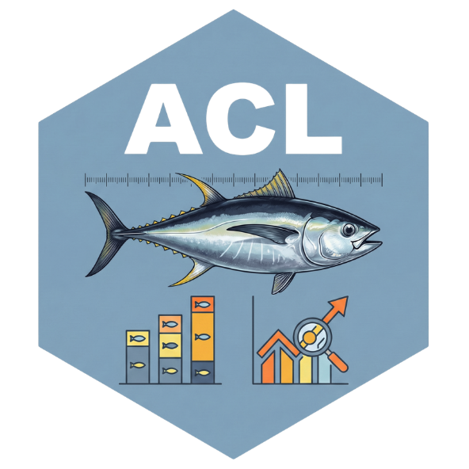

# ACL 

## Age- and Length-Structured Statistical Catch-at-Length Model

## 基于年龄和体长结构的统计体长渔获模型

[](https://cran.r-project.org/)
[](https://github.com/kaskr/adcomp)
[](LICENSE.md)

**ACL** is an R package implementing the age- and length-structured statistical catch-at-length model (ALSCL) described in:

> Zhang, F., & Cadigan, N. G. (2022). An age‐and length‐structured statistical catch‐at‐length model for hard‐to‐age fisheries stocks. *Fish and Fisheries*, 23(5), 1121–1135. https://doi.org/10.1111/faf.12673

**ACL** 是一个实现 ALSCL（年龄-体长结构统计体长渔获模型）的 R 包，其理论基础来自上述论文。

---

### Model Overview / 模型概述

Estimating cohort dynamics from length-based data is a major challenge for hard-to-age fisheries stocks. Traditional age-structured catch-at-length (ACL) models cannot account for **length-dependent processes within each cohort** — such as size-selective mortality and individual growth variability.

对于难以确定年龄的渔业种群，从体长数据估计队列动态是一大挑战。传统的年龄结构体长渔获模型（ACL）无法考虑**队列内部的体长依赖过程**，如大小选择性死亡和个体生长变异。

The ALSCL model addresses this by **simultaneously tracking three-dimensional population dynamics across time, age, and length**. Key features include:

ALSCL 模型通过**同时追踪时间、年龄和体长三个维度的种群动态**来解决这一问题。主要特点包括：

- **Survey-based (SURBAL)**: Uses only fisheries-independent survey data — catch-at-length, weight-at-length, and maturity-at-length — avoiding biases from fisheries-dependent data. / **基于调查（SURBAL）**：仅使用渔业独立的调查数据（体长渔获量、体重-体长、成熟度-体长），避免渔业依赖数据的偏差。

- **Age-length transition matrix**: Converts age-based dynamics to length-based observations through a growth transition probability matrix derived from the Von Bertalanffy growth model. / **年龄-体长转换矩阵**：通过基于 Von Bertalanffy 生长模型的生长转换概率矩阵，将基于年龄的动态转换为基于体长的观测。

- **TMB-powered**: Built on Template Model Builder for automatic differentiation, enabling efficient estimation of high-dimensional parameters with the Laplace approximation. / **TMB 驱动**：基于模板模型构建器实现自动微分，高效估计高维参数。

- **Comprehensive outputs**: Estimates recruitment, spawning stock biomass (SSB), total biomass, abundance-at-age/length, fishing mortality-at-age, and growth parameters (L∞, k) with uncertainty (95% CI via delta method). / **全面的输出**：估计补充量、产卵亲体生物量（SSB）、总生物量、各年龄/体长丰度、各年龄捕捞死亡率和生长参数（L∞, k），并提供不确定性（通过 delta 方法的 95% 置信区间）。

The model was validated using simulations of yellowtail flounder (*Limanda ferruginea*) and bigeye tuna (*Thunnus obesus*), and applied to estimate cohort dynamics of female yellowtail flounder on the Grand Bank off Newfoundland.

该模型通过黄盖鲽（*Limanda ferruginea*）和大眼金枪鱼（*Thunnus obesus*）的模拟验证，并应用于估计纽芬兰大浅滩雌性黄盖鲽的队列动态。

---

## Table of Contents / 目录

- [Model Overview / 模型概述](#model-overview--模型概述)
- [Installation / 安装](#installation--安装)
- [Quick Start / 快速开始](#quick-start--快速开始)
- [Step-by-Step Tutorial / 分步教程](#step-by-step-tutorial--分步教程)
- [Function Reference / 函数参考](#function-reference--函数参考)
  - [Core Functions / 核心函数](#core-functions--核心函数)
  - [Visualization Functions / 可视化函数](#visualization-functions--可视化函数)
- [Global Theme System / 全局主题系统](#global-theme-system--全局主题系统)
- [Parallel Processing / 并行处理](#parallel-processing--并行处理)
- [Citation / 引用](#citation--引用)

---

## Installation / 安装

```r
# Install from GitHub / 从 GitHub 安装
# install.packages("devtools")
devtools::install_github("Linbojun99/ACL", ref = "dev")
```

**Dependencies / 依赖包**: TMB, ggplot2, dplyr, tidyr, ggridges, gridExtra, parallel

---

## Quick Start / 快速开始

```r
library(ACL)

# Load built-in yellowtail flounder dataset / 加载内置黄盖鲽数据集
data(YTF)
data.CatL <- YTF$data.CatL
data.wgt  <- YTF$data.wgt
data.mat  <- YTF$data.mat

# Run the model / 运行模型
result <- run_acl(
  data.CatL = data.CatL, data.wgt = data.wgt, data.mat = data.mat,
  rec.age = YTF$rec.age, nage = YTF$nage, M = YTF$M,
  sel_L50 = YTF$q_surv_L50, sel_L95 = YTF$q_surv_L95,
  train_times = 2
)

# Plot key outputs / 绘制关键输出
plot_recruitment(result, se = TRUE)
plot_SSB(result, se = TRUE)
plot_fishing_mortality(result, by = "year", se = TRUE)
plot_CatL(result, by = "year", exp_transform = TRUE)
```

---

## Step-by-Step Tutorial / 分步教程

### Step 0: Detect CPU Cores / 检测 CPU 核心

```r
total_cores <- parallel::detectCores()
safe_cores  <- max(1, total_cores - 1)
cat(sprintf("Total cores: %d | Recommended: %d\n", total_cores, safe_cores))
```

| Function / 函数 | Purpose of `ncores` / 目的 | Recommended / 建议 |
|---|---|---|
| `run_acl(ncores)` | **Robustness** — multi-start avoids local optima / 稳健性 | 2–4 |
| `sim_acl(ncores)` | **Speed** — parallel across iterations / 加速 | `detectCores()-1` |
| `retro_acl(ncores)` | **Speed** — parallel across peels / 加速 | `detectCores()-1` |

### Step 1: Prepare Data / 准备数据

`run_acl()` requires 3 data frames, each with length bin labels in column 1 and years in subsequent columns.

| Data frame | Content / 内容 | Description / 说明 |
|---|---|---|
| `data.CatL` | Survey catch-at-length / 调查体长渔获量 | Number of fish caught per length bin per year |
| `data.wgt` | Weight-at-length / 体重-体长 | Mean body weight (kg) for each length bin |
| `data.mat` | Maturity-at-length / 成熟度-体长 | Proportion mature (0–1) for each length bin |

```r
library(ACL)
data(YTF)
data.CatL <- YTF$data.CatL   # 23 length bins × 20 years
data.wgt  <- YTF$data.wgt
data.mat  <- YTF$data.mat
```

### Step 2: Compile TMB Model / 编译 TMB 模型

```r
compile_and_load_acl()                    # Standard
compile_and_load_acl(openmp = TRUE)       # With OpenMP (Mac: brew install libomp)
```

### Step 3: Run the Model / 运行模型

```r
result <- run_acl(
  data.CatL = data.CatL, data.wgt = data.wgt, data.mat = data.mat,
  rec.age = YTF$rec.age, nage = YTF$nage, M = YTF$M,
  sel_L50 = YTF$q_surv_L50, sel_L95 = YTF$q_surv_L95,
  train_times = 2, ncores = 1, output = FALSE
)
result$converge     # "relative convergence (4)" = good
result$bound_hit    # FALSE = good
```

### Step 4: Visualize Results / 可视化结果

See [Visualization Functions](#visualization-functions--可视化函数) below for detailed usage of all 14 plot functions.

### Step 5: Model Diagnostics / 模型诊断

```r
diagnose_model(data.CatL, result)
# Checks: convergence, boundary, gradient, final NLL
```

### Step 6: Simulation Testing / 模拟检验

```r
sim_data(bio_fishing_vars = result$bio_fishing_vars,
         init_state_vars = result$init_state_vars,
         sim_year = 20, iter_range = 4:100, output_dir = "sim_output")

sim_results <- sim_acl(sim_data_path = "sim_output",
                        iter_range = 4:100, M = YTF$M, ncores = 7)
```

### Step 7: Retrospective Analysis / 回顾分析

```r
retro <- retro_acl(
  data.CatL = data.CatL, data.wgt = data.wgt, data.mat = data.mat,
  rec.age = YTF$rec.age, nage = YTF$nage, M = YTF$M,
  sel_L50 = YTF$q_surv_L50, sel_L95 = YTF$q_surv_L95,
  npeels = 3, ncores = 3
)
plot_retro(retro)
plot_retro(retro, rho_digits = 2, rho_position = "top_left")
```

---

## Function Reference / 函数参考

### Core Functions / 核心函数

| Function / 函数 | Description / 描述 |
|---|---|
| `compile_and_load_acl(openmp)` | Compile TMB model template with optional OpenMP / 编译 TMB 模型模板 |
| `run_acl(...)` | Main model fitting: compile → optimize → sdreport / 主模型拟合 |
| `sim_data(...)` | Generate simulated fishery datasets / 生成模拟渔业数据集 |
| `sim_acl(...)` | Fit model to each simulated dataset (parallel) / 对每个模拟数据集拟合模型 |
| `retro_acl(...)` | Retrospective analysis with Mohn's rho / 回顾分析 + Mohn's rho |
| `plot_retro(retro, rho_digits, rho_position)` | Plot retrospective patterns / 绘制回顾模式 |
| `diagnose_model(data.CatL, result)` | Convergence, boundary, gradient checks / 收敛、边界、梯度检查 |

#### Key `run_acl()` parameters / 关键参数:

| Parameter | Description / 描述 |
|---|---|
| `data.CatL`, `data.wgt`, `data.mat` | Required input data matrices / 必需输入数据矩阵 |
| `rec.age` | Age at recruitment (e.g. 1) / 补充年龄 |
| `nage` | Number of age groups (e.g. 15) / 年龄组数 |
| `M` | Natural mortality rate (e.g. 0.2) / 自然死亡率 |
| `sel_L50`, `sel_L95` | Survey selectivity parameters / 调查选择性参数 |
| `train_times` | Number of nlminb restarts (default 1) / 优化重启次数 |
| `ncores` | 1 = single start; >1 = parallel multi-start / 并行多起点 |
| `output` | If TRUE, auto-save all plots & tables / 自动保存图表 |
| `parameters`, `parameters.L`, `parameters.U` | Custom initial values & bounds / 自定义初始值和边界 |
| `map` | TMB map for fixing parameters / 固定参数 |

---

### Visualization Functions / 可视化函数

All plot functions share these **common parameters / 公共参数**:

| Parameter | Description / 描述 | Default |
|---|---|---|
| `line_size` | Line thickness / 线条粗细 | 1.2–1.5 |
| `line_color` | Line color / 线条颜色 | `"#D32F2F"` (red) |
| `se` | Show 95% confidence interval / 显示置信区间 | `FALSE` |
| `se_color`, `se_alpha` | CI ribbon color and transparency / CI 颜色和透明度 | red, 0.2 |
| `se_type` | `"ribbon"` or `"errorbar"` / 色带或误差棒 | `"ribbon"` |
| `x_breaks` | Custom x-axis breaks / 自定义 x 轴刻度 | `NULL` (auto) |
| `title`, `xlab`, `ylab` | Custom labels / 自定义标签 | `NULL` (auto) |
| `return_data` | Also return processed data / 同时返回数据 | `FALSE` |
| `facet_ncol`, `facet_scales` | Facet layout / 分面布局 | `NULL`, `"free"` |
| `font_family`, `title_size`, `base_theme` | Per-plot theme override / 单图主题覆盖 | inherits global |

---

#### `plot_recruitment(result, se, ...)`

Plots estimated annual **recruitment** — the number of new individuals entering the population at recruitment age (`rec.age`) each year. Recruitment is a key driver of population dynamics: strong year classes can sustain the stock even under fishing pressure, while recruitment failures lead to population declines.

绘制估计的年度**补充量** — 每年在补充年龄进入种群的新个体数量。补充量是种群动态的关键驱动力：强年级可以在捕捞压力下维持种群，而补充量失败会导致种群下降。

When `se = TRUE`, the 95% confidence interval is displayed as a shaded ribbon (default) or error bars (`se_type = "errorbar"`), reflecting estimation uncertainty from the delta method via TMB's sdreport.

```r
plot_recruitment(result, se = TRUE)
plot_recruitment(result, se = TRUE, se_type = "errorbar", x_breaks = seq(1, 20, 2))
```


---

#### `plot_SSB(result, type, se, ...)`

Plots **Spawning Stock Biomass (SSB)** — the total biomass of mature individuals capable of reproduction. SSB is one of the most important management quantities, directly linked to the population's reproductive potential.

绘制**产卵亲体生物量 (SSB)** — 能够繁殖的成熟个体的总生物量。SSB 是最重要的管理量之一，直接关系到种群的繁殖潜力。

| `type` | Output / 输出 | Description / 说明 |
|---|---|---|
| `"SSB"` (default) | Total SSB time series + optional 95% CI | Aggregate trend: is the spawning stock growing or declining? / 聚合趋势 |
| `"SBL"` | SSB by length bin (faceted) | Which body sizes contribute most to spawning biomass? Large mature females typically dominate. / 哪些体型对产卵生物量贡献最大？ |

Facet labels use open-ended notation for boundary bins: `Length bin <7` and `Length bin >49` (the plus-group).

```r
plot_SSB(result, type = "SSB", se = TRUE)
plot_SSB(result, type = "SBL")
```


---

#### `plot_biomass(result, type, se, ...)`

Plots **total biomass** — the weight of all individuals in the population regardless of maturity status. Unlike SSB which only counts mature fish, total biomass reflects the overall population size in weight units.

绘制**总生物量** — 种群中所有个体的重量（不考虑成熟状态）。与仅计算成熟鱼的 SSB 不同，总生物量反映了以重量为单位的整体种群规模。

| `type` | Output / 输出 | Description / 说明 |
|---|---|---|
| `"B"` (default) | Total biomass time series + optional 95% CI | Overall population weight trend / 总种群重量趋势 |
| `"BL"` | Biomass by length bin (faceted) | Biomass distribution across body sizes over time / 各体型生物量随时间的分布 |

```r
plot_biomass(result, type = "B", se = TRUE)
plot_biomass(result, type = "BL")
```


---

#### `plot_abundance(result, type, se, ...)`

Plots **population abundance** (number of individuals). Three disaggregation levels reveal different ecological signals:

绘制**种群丰度**（个体数量）。三个分解层次揭示不同的生态信号：

| `type` | Output / 输出 | Ecological insight / 生态学意义 |
|---|---|---|
| `"N"` (default) | Total abundance over years | Overall population size trend / 总种群规模趋势 |
| `"NA"` | Abundance-at-age (faceted by age group) | **Cohort tracking**: follow a strong/weak year class as it ages through the population / **队列追踪**：追踪强/弱年级随年龄变化 |
| `"NL"` | Abundance-at-length (faceted by length bin) | **Size structure dynamics**: how the number of fish in each size class changes over time / **大小结构动态** |

`"NA"` with `se = TRUE` shows how uncertainty increases for older age groups (fewer fish, less data), while `"NL"` reveals whether growth in total abundance is concentrated in small or large fish.

```r
plot_abundance(result, type = "N", se = TRUE)
plot_abundance(result, type = "NA", se = TRUE, facet_ncol = 4)
plot_abundance(result, type = "NL", facet_ncol = 5)
```


---

#### `plot_catch(result, type, se, ...)`

Plots **model-estimated catch** (not raw observed data). The model reconstructs catch from estimated fishing mortality and population abundance.

绘制**模型估计的渔获量**（非原始观测数据）。模型从估计的捕捞死亡率和种群丰度重构渔获量。

| `type` | Output / 输出 | Description / 说明 |
|---|---|---|
| `"CN"` | Total catch in numbers + optional 95% CI | How many fish were caught per year? / 每年捕了多少鱼？ |
| `"CNA"` | Catch-at-age (faceted by age group) | **Age composition of catch**: which ages are most heavily exploited? Derived from the model's internal age-length key. / **渔获年龄组成**：哪些年龄被重度捕捞？ |

```r
plot_catch(result, type = "CN", se = TRUE)
plot_catch(result, type = "CNA", facet_ncol = 4)
```


---

#### `plot_fishing_mortality(result, by, se, ...)`

Plots **fishing mortality rate (F)** — the instantaneous rate of death due to fishing. F is the primary management lever: managers set F targets (e.g., F_MSY) and compare estimated F to reference points.

绘制**捕捞死亡率 (F)** — 由捕捞导致的瞬时死亡率。F 是主要的管理杠杆：管理者设定 F 目标值（如 F_MSY）并将估计的 F 与参考点比较。

| `by` | X-axis | Facets | Purpose / 用途 |
|---|---|---|---|
| `"year"` (default) | Year | One per age group | **Management view**: Is F increasing or decreasing? Which ages face highest F? / 管理视角 |
| `"age"` | Age group | One per year | **Selectivity view**: Reveals the selectivity pattern (dome-shaped or logistic) in each year / 选择性视角 |

```r
plot_fishing_mortality(result, by = "year", se = TRUE, facet_ncol = 4)
plot_fishing_mortality(result, by = "age", se = TRUE, facet_ncol = 5)
```


---

#### `plot_CatL(result, by, exp_transform, ...)`

Compares **estimated vs. observed catch-at-length** — the core goodness-of-fit diagnostic. This shows how well the model reproduces the observed length-frequency data, which is the primary data input to the ALSCL model.

比较**估计 vs. 观测的体长渔获量** — 核心拟合优度诊断。显示模型重现观测体长频率数据的效果。

| `by` | View / 视角 | Display / 显示 | Best for / 最适用于 |
|---|---|---|---|
| `"length"` (default) | One panel per length bin | Black line (estimated) + red points (observed) on log scale | Detecting temporal trends in specific size classes / 检测特定体型的时间趋势 |
| `"year"` | One panel per year | Red line (estimated) vs. blue line (observed) on natural scale | Comparing full length distributions side-by-side / 并排比较完整体长分布 |

**Interpretation / 解读**: Good fit = points closely follow the line (by length) or red/blue curves overlap (by year). Systematic deviations indicate model misfit — e.g., consistently over-estimating large fish or missing the length distribution peak.

Additional parameters: `exp_transform = TRUE` (exponentiates log-scale data; recommended for `by = "year"`), `line_color1`/`line_color2` (estimated/observed colors), `point_color`/`point_size`/`point_shape` (observed data points in `by = "length"` mode).

```r
plot_CatL(result, by = "length")
plot_CatL(result, by = "year", exp_transform = TRUE)
```


---

#### `plot_ridges(result, palette, ridges_alpha, ...)`

Creates a **side-by-side ridgeline plot** comparing observed (left panel) and estimated (right panel) catch-at-length distributions across all years. Each year is a separate "ridge" stacked vertically, colored by year. This is a powerful visual summary — mismatches in peak location, distribution width, or secondary modes are immediately apparent.

创建**并排山脊图**，比较所有年份的观测（左面板）和估计（右面板）体长渔获量分布。每年为一个独立的"山脊"，垂直堆叠。峰值位置、分布宽度或次要模态的不匹配一目了然。

**18 built-in color palettes / 内置色板**: `viridis` (default), `plasma`, `inferno`, `magma`, `turbo`, `spectral`, `RdYlBu`, `RdYlGn`, `PuOr`, `BrBG`, `Set1`, `Set2`, `Set3`, `Paired`, `Dark2`, `Accent`, `Pastel1`, `Pastel2`. Also accepts custom color vectors: `palette = c("navy", "gold")`.

```r
plot_ridges(result)                              # Default viridis palette
plot_ridges(result, palette = "spectral")        # Rainbow
plot_ridges(result, palette = c("#1B2A4A", "#F39C12"))  # Custom
```


---

#### `plot_VB(result, age_range, se, text_size, text_color, ...)`

Plots the **Von Bertalanffy growth curve**: L(a) = L∞ × (1 − e^(−k(a − t₀))). Displays estimated L∞ (asymptotic length) and k (growth coefficient) as text annotations. The growth model is central to ALSCL — it determines the age-length transition matrix that links age-based dynamics to length-based observations.

绘制 **Von Bertalanffy 生长曲线**。在图上标注估计的 L∞（渐近体长）和 k（生长系数）。生长模型是 ALSCL 的核心——它决定了将年龄动态与体长观测联系起来的年龄-体长转换矩阵。

When `se = TRUE`, shows the 95% CI ribbon around the curve, reflecting uncertainty in L∞, k, and t₀.

| Parameter | Description / 描述 |
|---|---|
| `age_range` | Age range to plot, e.g. `c(1, 25)` / 绘制的年龄范围 |
| `text_size` | Font size for L∞, k text / 参数标注字号 |
| `text_color` | Color for parameter text / 参数标注颜色 |

```r
plot_VB(result, se = TRUE, age_range = c(1, 25))
```


---

#### `plot_pla(result, low_col, high_col)`

Visualizes the **age-length transition probability matrix (PLA)** as a heatmap. Each cell (age *a*, length bin *l*) shows the probability that a fish of age *a* falls in length bin *l*. This matrix is the fundamental bridge between age-based population dynamics and length-based survey observations in the ALSCL model.

以热力图可视化**年龄-体长转换概率矩阵 (PLA)**。每个单元格（年龄 *a*，体长组 *l*）显示年龄 *a* 的鱼落在体长组 *l* 的概率。该矩阵是 ALSCL 模型中连接年龄动态和体长观测的基础桥梁。

**Reading the heatmap / 解读热力图**:
- X-axis = age groups, Y-axis = length bins (small at bottom, large at top)
- Young fish (left columns) → concentrated in small length bins (bright at bottom-left)
- Old fish (right columns) → spread across large length bins (bright at top-right)
- The `>49` length bin acts as a plus-group accumulator (all fish larger than the last bin boundary)

```r
plot_pla(result)                                 # Default: white → red
plot_pla(result, low_col = "white", high_col = "steelblue")
```


---

#### `plot_residuals(result, by, f, ...)`

Plots **model residuals** (observed − estimated, in log space) to diagnose systematic patterns in model fit. Each panel shows three elements: a **black line** (raw residuals), a **blue dashed LOESS smooth** (trend detection), and a **red horizontal reference line at zero** (perfect fit).

绘制**模型残差**（对数空间的观测−估计）以诊断系统性拟合模式。每个面板显示三个要素：**黑色线**（原始残差）、**蓝色虚线 LOESS 平滑**（趋势检测）和**红色零参考线**（完美拟合）。

| `by` | View / 视角 | X-axis | What to look for / 关注点 |
|---|---|---|---|
| `"length"` (default) | One panel per length bin | Year | Are residuals in each size class randomly scattered, or is there a temporal trend? / 各体型残差是随机的还是有时间趋势？ |
| `"year"` | One panel per year | Length | Does the model systematically over/under-estimate certain sizes within each year? / 模型是否系统性地高估/低估某些体型？ |

**Interpretation / 解读**: Random scatter around zero = good fit. LOESS curve deviating from zero = systematic misfit. The `f` parameter controls the LOESS smoothing span (default 0.4; larger = smoother curve).

```r
plot_residuals(result, by = "length")
plot_residuals(result, by = "year", f = 0.6)
```


---

#### `plot_SSB_Rec(result, point_color, point_size, point_shape, ...)`

Creates a **scatter plot of SSB vs. Recruitment** — the stock-recruitment relationship, a fundamental concept in fisheries science. Each point represents one year. This relationship helps assess whether the spawning stock is large enough to produce adequate recruitment.

创建 **SSB vs. 补充量散点图** — 亲体-补充关系，渔业科学的基本概念。每个点代表一年。帮助评估产卵种群是否足够大以产生充足的补充量。

**Interpretation / 解读**:
- Positive trend → density-dependent recruitment (larger SSB = more recruits) / 正向趋势 → 密度依赖补充
- No clear trend → recruitment decoupled from SSB (common at moderate SSB levels) / 无明显趋势 → 补充与 SSB 脱钩
- Can be used post-hoc to fit Beverton-Holt or Ricker stock-recruitment curves / 可用于后续拟合 B-H 或 Ricker 曲线

```r
plot_SSB_Rec(result, point_size = 3)
```


---

#### `plot_deviance(result, type, se, log, ...)`

Plots **parameter deviations** (random effects) estimated by the model. These deviations capture year-to-year variability in recruitment and fishing mortality that is not explained by the deterministic model structure.

绘制模型估计的**参数偏差**（随机效应）。这些偏差捕获了确定性模型结构未解释的补充量和捕捞死亡率的年际变异。

| `type` | Output / 输出 | Description / 说明 |
|---|---|---|
| `"R"` (default) | Recruitment deviations | Year-to-year variability in recruitment success / 补充量的年际变异 |
| `"F"` | Fishing mortality deviations (faceted by age) | Year-to-year variability in F for each age / 各年龄 F 的年际变异 |

Parameters: `se = TRUE` (show error bars), `log = TRUE` (exponentiate to multiplier scale).

---

## Global Theme System / 全局主题系统

Set once, apply to all subsequent plots. / 设置一次，应用到所有后续图形。

```r
acl_theme_set(
  font_family     = "Helvetica",   # font / 字体
  base_size        = 14,           # base font size / 基础字号
  title_size       = 18,           # title size / 标题字号
  axis_title_size  = 14,           # axis title size / 轴标题字号
  axis_text_size   = 11,           # tick label size / 刻度字号
  strip_text_size  = 12,           # facet label size / 分面标签字号
  title_hjust      = 0.5,          # 0=left, 0.5=center, 1=right
  base_theme       = "minimal"     # "default","minimal","bw","classic","light","dark","void","linedraw","gray"
)
acl_theme_set()  # Reset to defaults / 重置
```

Per-plot override / 单图覆盖:
```r
plot_SSB(result, se = TRUE, font_family = "Times New Roman", title_size = 20, base_theme = "classic")
```

---

## Parallel Processing / 并行处理

**Level 1: Process parallelism** (`ncores` in `run_acl`, `sim_acl`, `retro_acl`)

| Function | `ncores = 1` (default) | `ncores > 1` |
|---|---|---|
| `run_acl` | Single-start + OpenMP gradient | Multi-start: N jittered starts, keep best |
| `sim_acl` | Sequential loop | Parallel across iterations |
| `retro_acl` | Sequential loop | Parallel across peels |

**Level 2: Thread parallelism** (OpenMP via `compile_and_load_acl(openmp = TRUE)`)

| Platform | Process | OpenMP |
|---|---|---|
| Mac | `parLapply` (socket) | `brew install libomp` |
| Linux | `mclapply` (fork) / `parLapply` | Built-in |
| Windows | `parLapply` (socket) | Rtools |

**Note**: `run_acl` multi-start total time ≈ slowest start (IS parallel). Purpose is **robustness** (avoid local optima), not speed. Sweet spot: `ncores = 2–4`.

---

## Citation / 引用

If you use ACL in your research, please cite:

```
Zhang, F., & Cadigan, N. G. (2022). An age‐and length‐structured statistical
catch‐at‐length model for hard‐to‐age fisheries stocks. Fish and Fisheries,
23(5), 1121–1135. https://doi.org/10.1111/faf.12673
```

**BibTeX:**

```bibtex
@article{zhang2022age,
  title={An age-and length-structured statistical catch-at-length model for hard-to-age fisheries stocks},
  author={Zhang, Fan and Cadigan, Noel G},
  journal={Fish and Fisheries},
  volume={23},
  number={5},
  pages={1121--1135},
  year={2022},
  publisher={Wiley},
  doi={10.1111/faf.12673}
}
```

For the R package / R 包:
```
Lin, B. (2025). ACL: Age- and Length-Structured Statistical Catch-at-Length Model.
R package version 1.5.2. https://github.com/Linbojun99/ACL
```

---

## License / 许可

MIT License. See [LICENSE.md](LICENSE.md) for details.
